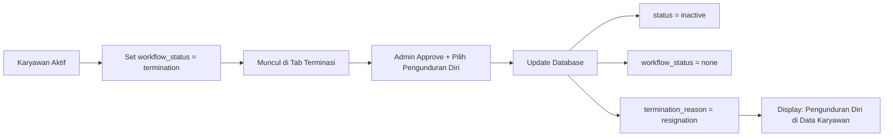

# Fitur Alasan Terminasi Karyawan

## Overview
Fitur ini menambahkan kemampuan untuk melacak dan menampilkan alasan terminasi karyawan. Ketika karyawan di-terminasi, sistem akan menyimpan alasan terminasi dan menampilkannya sebagai "Status Aktual Saat Ini" di Data Karyawan.

## Alasan Terminasi yang Tersedia

| Kode Database | Label Display | Deskripsi |
|---------------|---------------|-----------|
| `resignation` | Pengunduran Diri | Karyawan mengajukan resign |
| `retirement` | Pensiun | Karyawan mencapai usia pensiun |
| `contract_end` | Akhir Masa Kontrak | Kontrak kerja berakhir |
| `layoff` | Afkir | Pemutusan hubungan kerja |

## Database Schema

### Kolom Baru: `termination_reason`

```sql
ALTER TABLE employees
ADD COLUMN termination_reason VARCHAR(50)
CHECK (termination_reason IN ('resignation', 'retirement', 'contract_end', 'layoff'));

CREATE INDEX idx_employees_termination_reason ON employees(termination_reason);
```

**Karakteristik:**
- Type: VARCHAR(50)
- Nullable: YES (hanya diisi untuk karyawan yang di-terminasi)
- Constraint: CHECK untuk memastikan hanya nilai yang valid
- Index: Untuk performa query

## Cara Kerja

### 1. Proses Terminasi di Tab Terminasi

#### Step 1: Set Workflow Status
Admin mengubah `workflow_status` karyawan menjadi `'termination'` di Data Karyawan:
```typescript
workflow_status: 'termination'
```
Karyawan otomatis muncul di **Tab Terminasi**

#### Step 2: Approval Terminasi
Di Tab Terminasi, admin:
1. Klik tombol **Approve** (✓)
2. Dialog muncul dengan form:
   - **Alasan Terminasi** (Dropdown - Required)
   - **Pesangon** (Input Number - Optional)
   - **Catatan** (Textarea - Optional)

#### Step 3: Pilih Alasan Terminasi
Admin memilih salah satu:
- 📋 Pengunduran Diri
- 👴 Pensiun
- 📅 Akhir Masa Kontrak
- ⚠️ Afkir

#### Step 4: Submit Approval
Sistem melakukan update ke database:
```typescript
{
  workflow_status: 'none',        // Reset workflow
  status: 'inactive',             // Set inactive
  termination_reason: 'resignation' // Save reason
}
```

### 2. Display di Data Karyawan

#### Status Aktual Saat Ini (Tab Pekerjaan)

Setelah terminasi disetujui, field "Status Aktual Saat Ini" akan menampilkan:

**Untuk Karyawan dengan termination_reason:**
```
🔴 [Badge Merah] Pengunduran Diri
🔴 [Badge Merah] Pensiun
🔴 [Badge Merah] Akhir Masa Kontrak
🔴 [Badge Merah] Afkir
```

**Untuk Karyawan tanpa termination_reason (Aktif):**
```
🔵 Sedang Rekrutmen
🟠 Sedang Probasi
🔴 Dalam Proses Terminasi
⚪ Normal - Tidak Ada Status Khusus
```

**Logic Display:**
```typescript
if (selectedEmployee && selectedEmployee.terminationReason) {
  // Tampilkan alasan terminasi
  return <Badge>Pengunduran Diri</Badge>
} else {
  // Tampilkan workflow status
  return <Badge>Normal</Badge>
}
```

## Implementasi Detail

### 1. Employee Interface (EmployeeManagement.tsx)

```typescript
interface Employee {
  // ... fields lainnya
  workflowStatus?: "none" | "recruitment" | "probation" | "termination";
  terminationReason?: "resignation" | "retirement" | "contract_end" | "layoff";
}
```

### 2. Load Data dari Database

```typescript
const transformedData: Employee[] = (data || []).map((emp: any) => ({
  // ... mapping lainnya
  workflowStatus: emp.workflow_status,
  terminationReason: emp.termination_reason,
}));
```

### 3. Termination Component State

```typescript
const [terminationReason, setTerminationReason] = useState<
  'resignation' | 'retirement' | 'contract_end' | 'layoff'
>('resignation');
```

### 4. Approval Handler (Termination.tsx)

```typescript
if (actionType === 'approve') {
  const { error } = await supabase
    .from('employees')
    .update({
      workflow_status: 'none',
      status: 'inactive',
      termination_reason: terminationReason, // Save reason
    })
    .eq('id', selectedEmployee.id);
}
```

### 5. UI Display (EmployeeManagement.tsx - Tab Pekerjaan)

```tsx
<Label>Status Aktual Saat Ini</Label>
<div className="flex items-center h-10 px-3 py-2 rounded-md border">
  {selectedEmployee && selectedEmployee.terminationReason ? (
    <Badge variant="secondary" className="bg-red-500/10 text-red-500">
      {selectedEmployee.terminationReason === "resignation"
        ? "Pengunduran Diri"
        : selectedEmployee.terminationReason === "retirement"
        ? "Pensiun"
        : selectedEmployee.terminationReason === "contract_end"
        ? "Akhir Masa Kontrak"
        : "Afkir"}
    </Badge>
  ) : (
    // Display workflow status
  )}
</div>
```

## Alur Lengkap

### Scenario 1: Terminasi Pengunduran Diri



### Scenario 2: Terminasi Pensiun

```
1. Admin edit karyawan
2. Set workflow_status = 'termination'
3. Buka Tab Terminasi
4. Click Approve
5. Pilih alasan: "Pensiun"
6. Submit
7. Database updated:
   - status: inactive
   - workflow_status: none
   - termination_reason: retirement
8. Di Data Karyawan, Status Aktual: "Pensiun"
```

## Testing

### Test Case 1: Approve dengan Alasan Pengunduran Diri
```
✅ Set karyawan ke workflow_status = termination
✅ Buka Tab Terminasi
✅ Click Approve
✅ Pilih "Pengunduran Diri"
✅ Submit
✅ Verify database: termination_reason = 'resignation'
✅ Check Data Karyawan: Status Aktual = "Pengunduran Diri"
```

### Test Case 2: Approve dengan Alasan Pensiun
```
✅ Set karyawan ke terminasi
✅ Approve dengan reason = Pensiun
✅ Verify: termination_reason = 'retirement'
✅ Display: "Pensiun"
```

### Test Case 3: Approve dengan Alasan Akhir Kontrak
```
✅ Approve dengan reason = Akhir Masa Kontrak
✅ Verify: termination_reason = 'contract_end'
✅ Display: "Akhir Masa Kontrak"
```

### Test Case 4: Approve dengan Alasan Afkir
```
✅ Approve dengan reason = Afkir
✅ Verify: termination_reason = 'layoff'
✅ Display: "Afkir"
```

### Test Case 5: Reject Terminasi
```
✅ Reject terminasi
✅ Verify: termination_reason = NULL
✅ Verify: status = active
✅ Display: Status workflow biasa
```

## Files yang Diubah

| File | Perubahan |
|------|-----------|
| `migrations/add_workflow_status_to_employees.sql` | ✅ Added termination_reason column |
| `src/components/EmployeeManagement.tsx` | ✅ Added terminationReason to interface |
| | ✅ Updated loadEmployees to read termination_reason |
| | ✅ Updated Status Aktual display logic |
| `src/components/Termination.tsx` | ✅ Added terminationReason state |
| | ✅ Added dropdown for reason selection |
| | ✅ Updated approval to save termination_reason |

## UI Components

### Termination Tab - Approval Dialog

```
┌─────────────────────────────────────────┐
│  Setujui Terminasi                      │
├─────────────────────────────────────────┤
│                                         │
│  ⚠️  Warning message                    │
│                                         │
│  Alasan Terminasi *                     │
│  ┌─────────────────────────────────┐   │
│  │ Pengunduran Diri          ▼     │   │
│  └─────────────────────────────────┘   │
│  - Pengunduran Diri                     │
│  - Pensiun                              │
│  - Akhir Masa Kontrak                   │
│  - Afkir                                │
│                                         │
│  Pesangon (Optional)                    │
│  ┌─────────────────────────────────┐   │
│  │                                 │   │
│  └─────────────────────────────────┘   │
│                                         │
│  Catatan                                │
│  ┌─────────────────────────────────┐   │
│  │                                 │   │
│  │                                 │   │
│  └─────────────────────────────────┘   │
│                                         │
│           [Batal]  [Setujui]            │
└─────────────────────────────────────────┘
```

### Data Karyawan - Tab Pekerjaan

```
┌─────────────────────────────────────────┐
│  Status Workflow                        │
│  ┌─────────────────────────────────┐   │
│  │ Tidak Ada                 ▼     │   │
│  └─────────────────────────────────┘   │
│                                         │
│  Status Aktual Saat Ini                 │
│  ┌─────────────────────────────────┐   │
│  │ 🔴 Pengunduran Diri             │   │
│  └─────────────────────────────────┘   │
└─────────────────────────────────────────┘
```

## Data Flow

```
┌─────────────────┐
│   Tab Terminasi │
│                 │
│  [Approve]      │
│  + Select Reason│
└────────┬────────┘
         │
         ▼
┌─────────────────┐
│   Supabase DB   │
│                 │
│  UPDATE:        │
│  - status       │
│  - workflow     │
│  - term_reason  │
└────────┬────────┘
         │
         ▼
┌─────────────────┐
│  Data Karyawan  │
│                 │
│  Display:       │
│  Status Aktual  │
│  = Reason       │
└─────────────────┘
```

## Benefits

1. **Tracking Lengkap**: Semua alasan terminasi tercatat di database
2. **Reporting**: Data dapat digunakan untuk analisis turnover
3. **Transparency**: Alasan terminasi jelas terlihat di profil karyawan
4. **Compliance**: Memenuhi requirement HR untuk dokumentasi
5. **User Friendly**: Dropdown memudahkan input dan konsistensi data

## Best Practices

### Untuk Admin/HR
1. **Pastikan Alasan Tepat**: Pilih alasan yang sesuai dengan kondisi sebenarnya
2. **Dokumentasi**: Gunakan field Catatan untuk detail tambahan
3. **Pesangon**: Input nilai pesangon jika applicable
4. **Review**: Double-check sebelum approve (irreversible)

### Untuk Developer
1. **Validation**: termination_reason wajib diisi saat approve
2. **Display**: Prioritaskan terminationReason di atas workflowStatus
3. **Nullable**: termination_reason NULL untuk karyawan aktif
4. **Indexing**: Gunakan index untuk query performance

## Future Enhancements

1. **History Log**: Track perubahan termination_reason
2. **Reports**: Dashboard analytics berdasarkan alasan terminasi
3. **Auto Calculate**: Perhitungan otomatis pesangon based on tenure
4. **Document Upload**: Attach surat terminasi/resign
5. **Exit Interview**: Integration dengan exit interview form
6. **Notification**: Email notification ke karyawan yang di-terminasi

## Troubleshooting

### Issue: Status Aktual tidak berubah setelah approve
**Solution**:
- Refresh halaman Data Karyawan
- Check database: termination_reason ada nilai
- Verify selectedEmployee di edit mode

### Issue: Dropdown alasan tidak muncul
**Solution**:
- Check actionType === 'approve'
- Verify dialog is open
- Check terminationReason state

### Issue: Database constraint error
**Solution**:
- Pastikan nilai adalah salah satu dari: resignation, retirement, contract_end, layoff
- Run migration SQL terlebih dahulu

---

## Migration Command

```bash
# Via Supabase Dashboard
1. Buka Supabase Dashboard → SQL Editor
2. Copy dari: migrations/add_workflow_status_to_employees.sql
3. Run Query
```

## Conclusion

Fitur alasan terminasi memberikan tracking yang lebih detail untuk proses terminasi karyawan. Dengan 4 kategori alasan yang jelas, data terminasi menjadi lebih terstruktur dan mudah dianalisis.

**Status**: ✅ Production Ready (setelah migration)

**Version**: 2.1.0
**Date**: 2025-01-08
**Author**: Sistem Payroll Team
